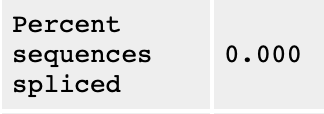
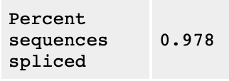
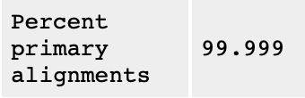
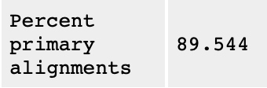
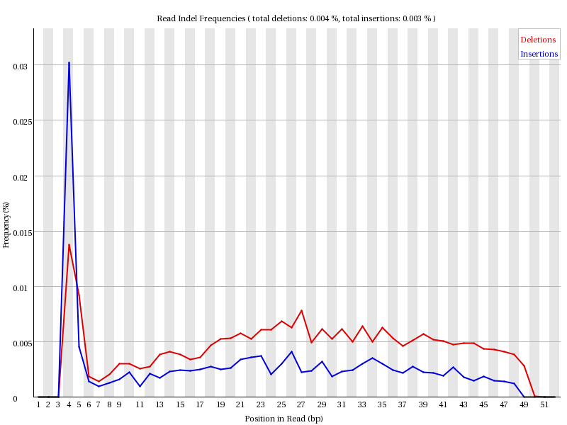
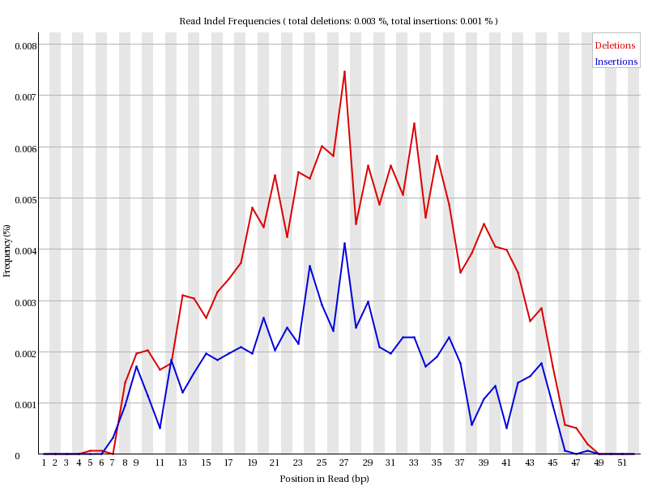
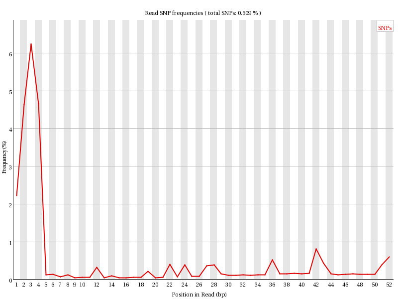
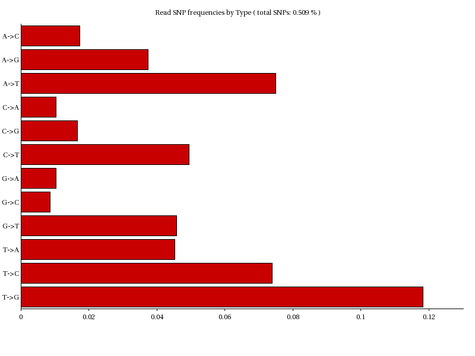
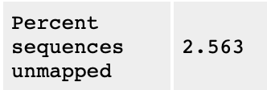
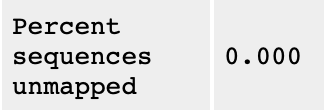

```{r setup, include=FALSE}
knitr::opts_chunk$set(echo = TRUE)
```

## R Markdown - HW Week 6 - Tomer M. Yaron

## 1 - The difference between alignment score and mapping quality in SAM/BAM files

Alignment score (AS) is based on the alignment matrix, in which you basically earn score for matches and loose score for mismatches and gaps (depends on the define penatly for each). Mapping quality (MQ) is defined to be −10*log(Pr{mapping position is wrong}) which is an indicator for the confidence that the read came from the position it was mapped to.

I.e., high AS and low MQ will refer to a read that aligns perfectly (or almost perfectly) but to multiple plcaes in the genome (and therefore the confidence it came from one specific position is low), whereas low AS and high MQ will indicate a read which aligns with mismatches and gaps, but still unique enough for being mapped to one specific position rather to any other position in the genome.

_____________________________________________________________________

## 2 - Runnign BamQC over BWA and STAR Bam files

```{BamQC}

./bamqc -o ./output/ /athena/elementolab/scratch/toy2005/angsd/hw4/BWA/ERR458878.bwa.bam
./bamqc -o ./output/ /athena/elementolab/scratch/toy2005/angsd/hw4/STAR/ERR458878.Aligned.sortedByCoord.out.bam 

```

_____________________________________________________________________

## 3 - Differences between the BamQC results for BWA and STAR

1. **Spliced Reads**: BWA does not consider spliced reads (it treat the read as partial mismatch, see Q4 below), whereas STAR does allow spliced reads. Therefore, while for BWA (left) the "Percent sequences spliced" is 0.000, for STAR (right) it is 0.978:

 

2. **Percent Primary Alignments**: Since BWA (left) does not enable spliced reads, then most of the reads are primary mapped, i.e. mapped unambiguously to one position in the genome (or unmapped at all). However, in STAR (right), where sliced reads are allowed, one read can be mapped to multiple different regions, and so the first mapping will be the "Primary Alignment" and all the rest will be "Secondary Alignments".

 

3. **Indel Frequencies**: As explained in Q4 below, BWA does not allow spliced reads, and thus it will match one part of the read the the second part will be consodered as deletion and/or insertion. Therefore, the Indel Pattern of the BWA and the STAR are significantly different. In particular, there is much higher frequency of 3-6 bp indels in the BWA, which in STAR would be considered as mapped to another region of the genome and would be considered as spliced reads.

BWA Indel Frequencies:



STAR Indel Frequencies:



4. **SNP Frequencies**: for the same reason of the Indel Pattern defferences, we have also a difference in the SNP frequencies. While in the STAR alignment they were no SNPs, in the BWA, in a case of a spliced read, the unmapped part of the read can sometimes be considered as SNP (or Indel, depends on the scoring matrix). Hence, in the STAR alignment there are no SNPs, whereas in the BWA alignment there are SNPs:





_____________________________________________________________________

## 4 - Splitted reads

In order to find the splitted read - which are splice junctions, we will look at ERR458878.SJ.out.tab file. The columns in the file have the following meaning:  
* column 1: chromosome  
* column 2: first base of the intron (1-based)  
* column 3: last base of the intron (1-based)  
* column 4: strand (0: undefined, 1: +, 2: -)  
* column 5: intron motif: 0: non-canonical; 1: GT/AG, 2: CT/AC, 3: GC/AG, 4: CT/GC, 5: AT/AC, 6: GT/AT  
* column 6: 0: unannotated, 1: annotated (only if splice junctions database is used)  
* column 7: number of uniquely mapping reads crossing the junction  
* column 8: number of multi-mapping reads crossing the junction  
* column 9: maximum spliced alignment overhang  

In order to find splitted reads, we will look for read which their CIGAR string contains N (uskip region == gap). for that we will use the following command:

```{STAR_SPLIT}
awk '/[0-9]N/' ./ERR458878.Aligned.chrI.sortedByCoord.out.sorted.bam | head
```

we got:

```
ERR458878.1021866	272	chrI	140241	1	43M566N8M	*	0	0	GGATAATGGAGCGACATCCAACAACAATAGATCTTGAGTCTTGAATCAAGA	?4>B9D<FD?8:9BGF>CA823<,HH@HCEB<C;FE:;DDCA222244111	NH:i:4	HI:i:2	AS:i:41	nM:i:0  
ERR458878.1055117	272	chrI	7860	3	11M125565N40M	*	0	0	TTCCAACAGAAATACACAAAAGAAAGAAGATAATCAAGTGGTACCGAAAAG	GBGJJJJJGIHGDGHHGIIGG@JJJIIGGGHIIGJJIGFFFBCFFDBD@@@	NH:i:2	HI:i:2	AS:i:39	nM:i:0  
ERR458878.106011	256	chrI	73033	3	39M144745N12M	*	0	0	AAACTGTCCAATCATCTTGGTTACCAGATGCCCAAGAGCTTTTAATTTTTT	=??1DD,?DDD>??DEEDFE<CCFEEDFCF<F1?#################	NH:i:2	HI:i:2	AS:i:39	nM:i:0  
ERR458878.1066648	16	chrI	142248	255	6M366N45M	*	0	0	TGAAGGTACTGCTGTTTCTCAAGCTGACGTCACTGTCTTCAAGGCTTTCCA	@D??<FB08GF@BBB??BC?BGB@;C2AA333BFA<A?BCBDA:?DDD7@@	NH:i:1	HI:i:1	AS:i:51	nM:i:0  
ERR458878.1069019	256	chrI	81343	3	11M61419N40M	*	0	0	AGAAGAAGAGGTGACGATGTCGATTTATTCGGTTCCGACGATGAAGAAGCT	@<?BDD:BHDD<AFGHE??E?BDGIIICA?31CD;@@GIBACFF;@FFFH@	NH:i:2	HI:i:2	AS:i:39	nM:i:0  
ERR458878.1083582	0	chrI	142219	255	35M366N16M	*	0	0	AACGCTTCTTTGGCTGACAAGTCATACATTGAAGGTACTGCTGTTTCTCAA	CC@FFFFFHHHHHJJJJJJJJCHIIGJGIJJCHIJDEHIJJJJIJJJIJFJ	NH:i:1	HI:i:1	AS:i:51	nM:i:0  
ERR458878.1085919	256	chrI	72727	3	43M91528N8M	*	0	0	AGTTTCCGATGTCGGTAACGCTCTCTTGGATGGTGCTGACTGTGCTATGTT	:;?D7D4A82<DA=AEEE+1C:)::?*:C*:3@*:4?*9)**09*9?B=B#	NH:i:2	HI:i:2	AS:i:45	nM:i:1  
ERR458878.1086228	16	chrI	94493	3	37M33658N14M	*	0	0	GTATTTGTATATCAAAAAATGATCCTGTGATTTTTTCAAAAAGAAAAAAAA	HHHHHHJIJGHEGJJJJJIJJIIJJJJJIIJJJJJIIJHHHHHFFFFFBCC	NH:i:2	HI:i:1	AS:i:39	nM:i:0  
ERR458878.1086228	272	chrI	94493	3	37M97949N14M	*	0	0	GTATTTGTATATCAAAAAATGATCCTGTGATTTTTTCAAAAAGAAAAAAAA	HHHHHHJIJGHEGJJJJJIJJIIJJJJJIIJJJJJIIJHHHHHFFFFFBCC	NH:i:2	HI:i:2	AS:i:39	nM:i:0  
ERR458878.1090280	256	chrI	119210	1	12M85128N38M1S	*	0	0	CAATACACCAACAACTGCTAGCACCATCATAACTACGACCGAACCATGGAC	@@@+BDDAFFF=B?:<<ECH><>F=;FFCFEGF4C<;0DFFE@@FF;=@##	NH:i:3	HI:i:3	AS:i:36	nM:i:5
```

Let's take a look on read ERR458878.1055117:

```
ERR458878.1055117	272	chrI	7860	3	11M125565N40M	*	0	0	TTCCAACAGAAATACACAAAAGAAAGAAGATAATCAAGTGGTACCGAAAAG	GBGJJJJJGIHGDGHHGIIGG@JJJIIGGGHIIGJJIGFFFBCFFDBD@@@	NH:i:2	HI:i:2	AS:i:39	nM:i:0
```

Its CIGAR string is 11M125565N40M, which means we have 11 matches, then 125565 skips (gaps), then 40 matches again (51 matches in total). STAR identified this read as mapped to two sides of a splice junction.

However, in BWA, this is how the read is presented:

```{BWA_SPLIT}
egrep 'ERR458878.1055117' ERR458878.bwa.chrI.sorted.bam
```

which results in:

```
ERR458878.1055117	16	chrI	133436	60	11S40M	*	0	0	TTCCAACAGAAATACACAAAAGAAAGAAGATAATCAAGTGGTACCGAAAAG	GBGJJJJJGIHGDGHHGIIGG@JJJIIGGGHIIGJJIGFFFBCFFDBD@@@	NM:i:0	MD:Z:40	AS:i:40	XS:i:0
```

As we can see, the CIGAR string for this read in BWA is 11S40M, which means 11 mismatches and then 40 matches. Where STAR handle this read with a big gap and therefore identified this site as a splice junction, BWA did not take into account a splice junction and therefore consider the 11 first bases as mismatch to the next 40 bases, instead of as to matches with an intron in between.

_____________________________________________________________________

## 5 - Removing unmapped reads from the BWA output

The FLAG field in the SAM/BAM file indicate different properties of each read. Specifically, the binary flag 00000000100, which is 4 in decimal values, indicate "The read is unmapped". Therefore, by filtrating the BAM file for only the reads without this flag (using samtools), we will get rid of all the unmapped reads.

```{UNMAPPED_BWA}
samtools view -b -F 4 ./../hw4/BWA/ERR458878.bwa.bam > ./results/ERR458878.bwa.mapped.bam
~/angsd/hw5/bamqc -o ./results/ ./results/ERR458878.bwa.mapped.bam
```

As we can see, while in the original BWA Bam file (left) there were 2.563% of unmapped reads, after the filtartion (right) we have 0.000% of unmapped reads:

 


