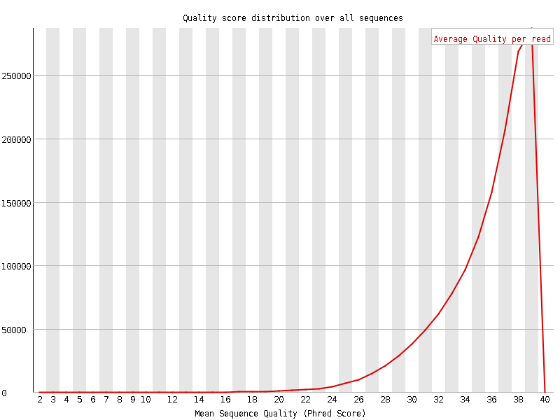
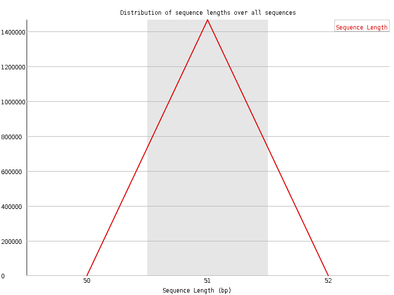
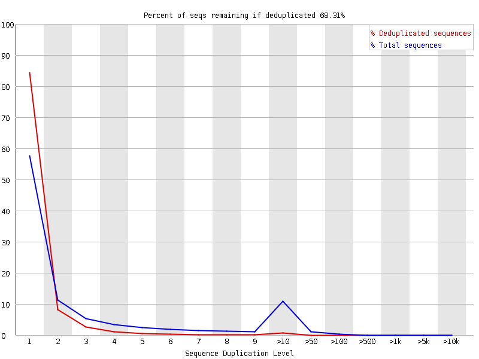

```{r setup, include=FALSE}
knitr::opts_chunk$set(echo = TRUE)
```

## R Markdown - HW 11 - Tomer M. Yaron

## 1 - Nanopore sequencing

### a - The principle of Nanopore sequencing

Nanopore sequencing is a sequencing technique which uses the electircal changes in small pores (of size within the nanometric range), in order to detect the nucleic acids composition of the DNA or RNA. When applying an electric field over small nanometric pores (Nanopores) which contain electrolytic solution, an electric current can be detected. This current will depend on the surface area of the nanopore and on the specific bases within the nanopore. Thus, by measuring the changes in the electric currect very close to the nanopore while moving one strand of the DNA or RNA through it, the system is able to retrieve the sequence of nucleic acids.

### b - Labeling figure


**1a**: DNA molecule (double-stranded).  
**1b**: One strand of the DNA (single-stranded DNA).  
**2**: DNA processive enzyme (unwinding enzyme) / enzyme motor: is used for controlling the translocation of the DNA/RNA strand through the nanopore, such as phi29 DNA polimerase.
**3**: Membrane / microscaffolds: the surface which holds the nanopores, and through which a voltage is being applied (for measuring the current trough the nanopore).  
**4**: Nanopore. Can be a biological nanopore (pore-forming proteins such as $\alpha$-hemolysin protein), or solid materials (solid-state nanopores).

### c - Properties of the nanopore molecule

1. **Nanometric size**: the pores must have a size in the nanometric range, in order to enable the passage of single molecules through it (such as single-stranded DNA).
2. **High stability**: the nanopore protein / molcule must be highly stable in order to enable the sequencing of long DNA/RNA molecules at once, without changing affecting the measured electric current.

### d - Change of current measurement

The change of the electric current is measured below the nanopore very close to its surface by an electrode that is connected to a channel. Each nanopore has its own sensor, which measures the change in the current for this particular nanopore. Multiple nanopores with their electrodes are sitting in the sensor array chip.

### e - Naturally occuring processive enzymes

The processive enzymes are meant to control the speed in which the DNA/RNA molecule is running through the nanopore, as well as to unwind the double-stranded DNA. Therefore, those enzymes shold have high affinity to DNA/RNA molecules, and to move along them efficiently. In addition to that, they must be stable under the electrical field which is applied over the nanopore (for the current measurement).

Therefore, the natural candidates are DNA processing enzymes and polymerases. Specifically, _phi29 DNAP_ is is a very common DNA polymerase used in Nanopore sequencing.

### f - Adapters types

1. **Y-adapter**: this is the leader adapter, and it's called Y-adapter since it has a _Y_ shaped structure. This adapter is being ligated to the 5' end of the DNA strands, and is used for directing the DNA into the nanopore.

2. **HP-adapter**: hairpin adapter, named like that due it its hairpin structure. This adapter is ligated at the 3'end os the strands, for facilitating the entrance of the complementary strand to the nanopore right after the template starnd ended passing throuhg. In a 1D (one direction) mode, the complementary strand will just be released and then can enter to a nanopore like every other molecule, whereas in the 2D (two directions) mode, by using the HP protein and adapter, the complementary strand is being inserted into the nanopore right after the template starnd.

3. **Barcode**: in order to sequence multiple different libraries at the same time, we can barcode each library with a known barcode (adapter), and by retrieving its sequence - to demultiplex the entire sequences into different libraries.

_____________________________________________________________________

## 2 - Nanopore sequencing Vs. Illumina sequencing

### Advantages of Nanopore sequencing:

1. **Long reads**: since the Nanopore system is measuring the change in the current, we are not limited in the length of the read/molecule we can sequence. Therefore, while in Illumina we are limited to a certain read length (~50-200bp), in Nanopore sequencing we can sequence very long molecules at once.

2. **Real-time**: in Nanopore sequencing, the current is being measured and converted to sequence in real-time, and therefore we can see the sequence while it is being sequenced. That allow us to pre-program the sequencing process to be dependent on the real-time results. For example, if we are interested to sequence only specific part of the DNA with a known sequence start, we can insert this signature to the _Read until..._ mode, and by that to analyse only DNA strands that contain predetermined signatures of interest. The beginning of the DNA sequence is being analysed in real-time. If it matches the provided signature, sequencing continues. If not, then the DNA strand can be rejected from the pore in real time, allowing that pore to sequence other reads. This method allows selective sequencing, improving both the time to result and the efficiency of an experiment. In contrast, in Illumina there is no way to analyze the reads in real-time, and therefore we need to sequence all the reads and only then to do post processing.

3. **Cost**: Illumina sequencing machine costs 500K-1M\$, the Nanopore suqeuncer (MinION) costs only ~1000\$.

### Disadvantages of Nanopore sequencing:

1. **Higher error rate**: Whereas the current Illumina sequencing pipeline has ~1-2% (and sometimes even less), for Nanopore sequencing the error rate is ~8-9% (officially reported: 5-15%).

2. **Sequencing depth**: in Nanopore sequencing we are sequencing much less reads than in Illumina (in our case - 4000 reads per pore). Therefore, we have much less coverage for each nucleotide, i.e. much lower sequence depth (for mutation calling etc.).

_____________________________________________________________________

## 3 - Basic QC

### a - FastQC

```{fastqc}
ln -s /home/frd2007/ANGSD_2019/nanopore_seq/guppy_out/
for f in ./guppy_out/*.gz
  do fastqc -o /athena/elementolab/scratch/toy2005/angsd/hw11/fastqc/ $f --extract
done
```

### b - Differences between Nanopore and Illumina

1. **Per base sequence quality**: the sequence quality per base is significantly lower in the Nanopore sequencing compare to the Illumina sequencing. As we can see in the figures below, while in Illumina most of the reads have Phred Score of ~35-39, in Nanopore most of the reads have Phred Score of ~24.

#### Nanopore sequence quality:
 

#### Illumina sequence quality:
 

2. **Sequence Length Distribution**: the read length of the Nanopore sequencing is much higher than in the Illumina sequencing. As we can see in the distribution below, whereas in Illumina the reads length is pre-definied (in that case - 50bp), in Nanopore is vary and can get to more than 35Kbp.

#### Nanopore length distribution:


#### Illumina length distribution:


3. **Sequence Duplication Levels**: in Illumina sequencing we get much more duplicated sequences due to the deep coverage and the short reads (sometimes up to 40%). In contrast, in Nanopore sequencing we almost don't get any duplicated sequences, since we sequence the entire DNA/RNA molecules.

#### Nanopore duplication levels:


#### Illumina duplication levels:
