```{r setup, include=FALSE}
knitr::opts_chunk$set(echo = TRUE)
```

## R Markdown - HW 4 - Tomer M. Yaron

## 1 - Getting the fastq files

Logging in to the server:

```{login}
ssh toy2005@aristotle.med.cornell.edu
ssh buddy.pbtech
```

Create a directory for the HW:

```{mkdir}
cd angsd
mkdir hw3
cd hw3
mkdir databases
cd databases
cp -r ./../../hw2/databases/ENA_files/ ./
cd ./../../
mkdir ./output
mkdir ./output/fastqc_original

```

### a - Running FastQC on the files:

```{fastqc}
for f in ./databases/ENA_files/*
  do fastqc -o ./output/fastqc_original/ $f --extract
done

rm ./output/fastqc_original/*.zip
```

### b - Running Trim-Galore on the files:

```{trimgalore}
mkdir ./output/trimmed_fastq
for f in ./../../databases/ENA_files/*
  do trim_galore --illumina $f
done

for f in ./output/trimmed_fastq/*.gz; do fastqc -o ./output/fastqc_trimmed/ $f --extract; done
```

### c - Running FastQC on the trimmed files:

```{fastqc_trimmed}
for f in ./output/trimmed_fastq/*.gz
  do fastqc -o ./output/fastqc_trimmed/ $f --extract
done

rm ./output/fastqc_trimmed/*.zip
```

### d - Copying results from the server and comparing them:

```{results_compare}
scp -r toy2005@pascal.med.cornell.edu:./angsd/hw3/output/* ./Desktop/
```

First, we can see that in this case (this specific project), there is no significant improvment in the quality of the reads after trimming (left - before trimming; right - after trimming):

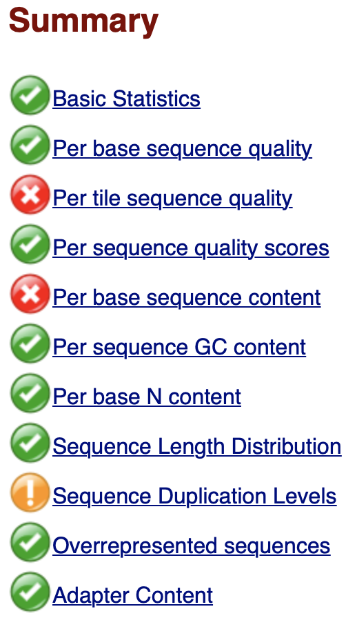 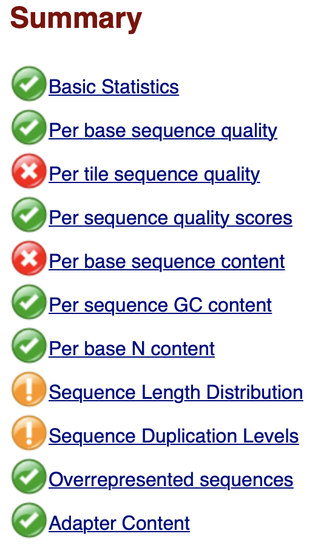

only the sequence length distribution changed, which makes sense since we trimmed some of the reads in different lengths. The other read-dependent parameters (GC content etc.) remained the same.

______________________________________________________________________

#### General analysis

The quality of the first bases sequencing in every read is lower than the bases afterwards, but it is still in the acceptible Phred-score range:


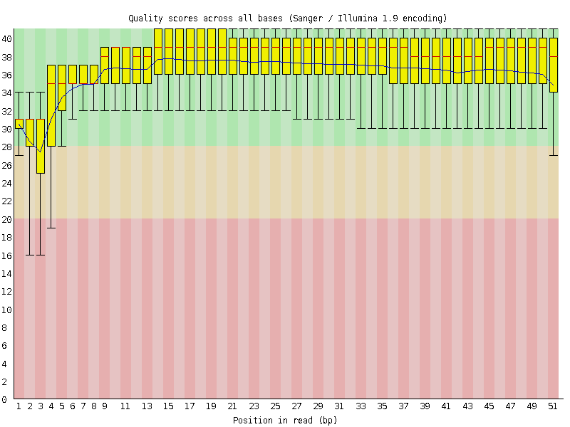

We can see that across almost all tiles the quality was poor for the first 5 bases (maybe due to short longth of the sequenced read):

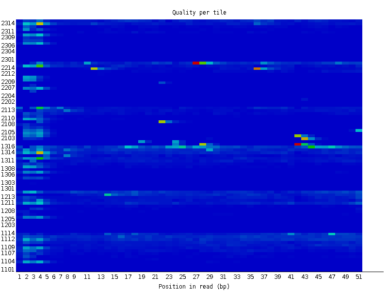

In addition, we can see 2-3 tiles that are low quality along the entire read sequencing, naybe due to dust or sonething else that affected the tile itself.

However, we can see that overall, most of the sequences have high quality score:


When analyzing the base content, we see that there is ~30% of A/T, and ~20% of G/C. even though that was marked as an issue in the FastQC analysis, that might be a characteristic of this specific dataset:

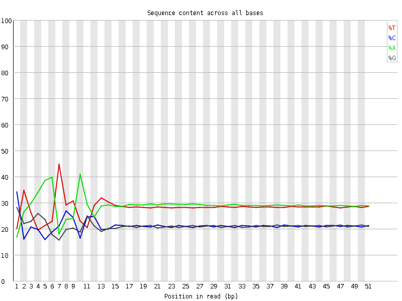

the GC content looks good, as well as the N content (unidentified base call):

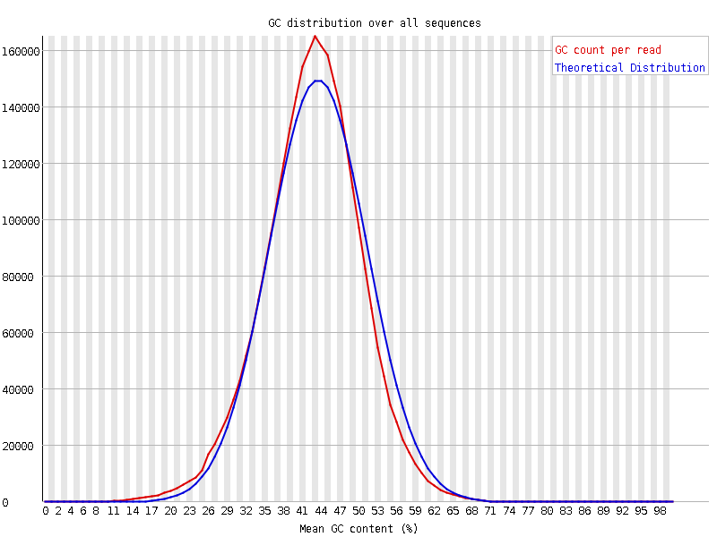

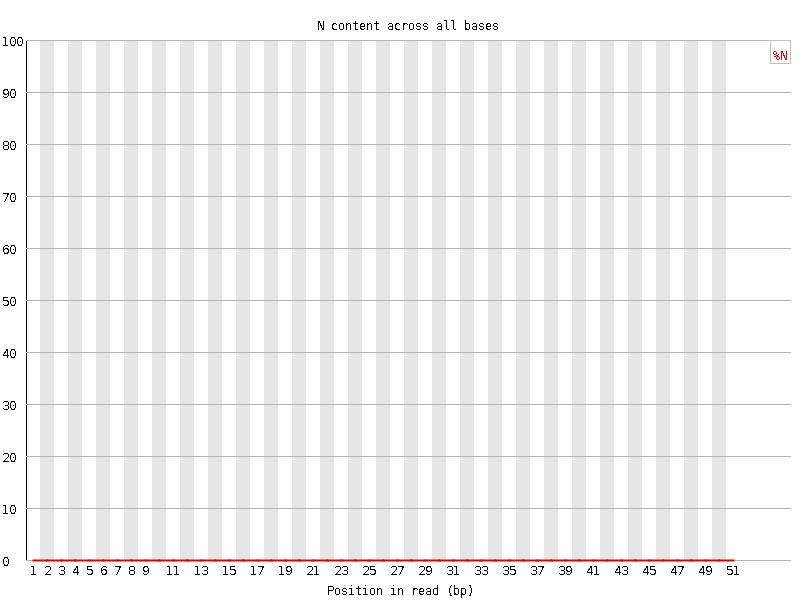

#### Differences with trimming and other special cases

First, we can see that the base sequence content AFTER TRIMMING is changed dramatically at the 51-position and we lose all the A, because it is the first letter of the adapter, and since we allowed overlap of 1 base between the read and the adapter, all the A which appear at the beginning of the read will be deleted.

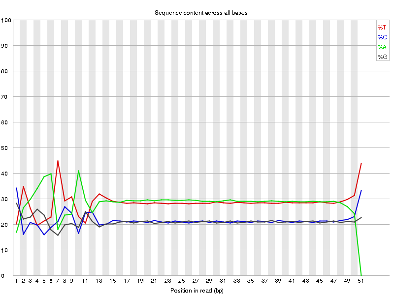

But we will use that since we want to be strict regarding this sequencing. I.e., we prefer to lose a real A that will be recovered when this A will appear in the middle of a read (and therefore won't be trimmed), rather than having an A from the adapter as part of our sequence, that can be considered later as a flase mutation.

In addition, the sequence length distribution was 50 for all the reads before trimming (because that was the sequencing length specified in the Illumina machine), but after trimming, since we trimmed differecnt lengths of the reads, we got a little bit different distribution:

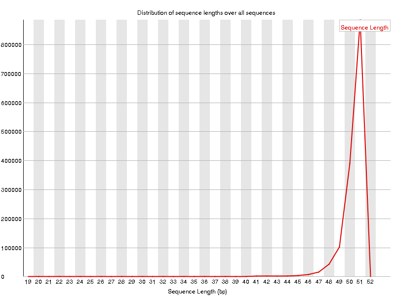

Another interesting point is in ERR458881, in which we can see that tiles 2202-2214 have very low quality for position 6-9 of the reads:

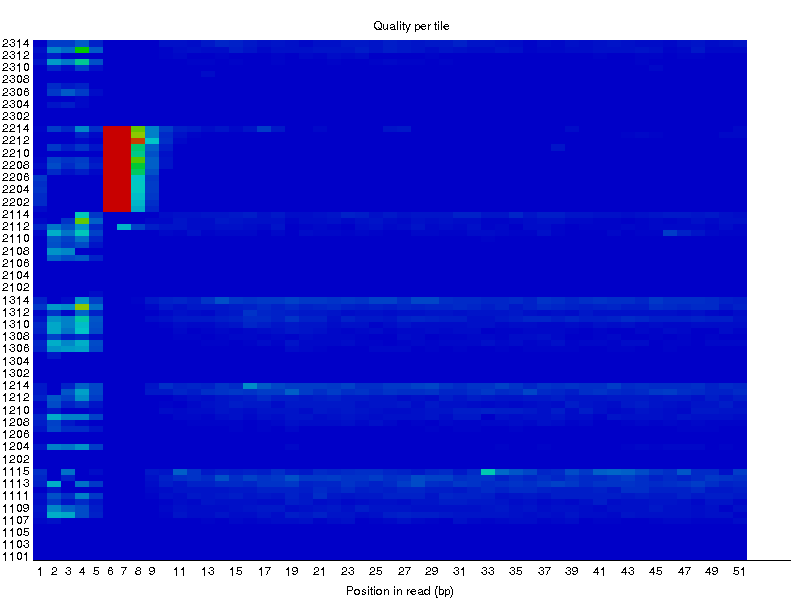

and we will also get that in the sequence quality:

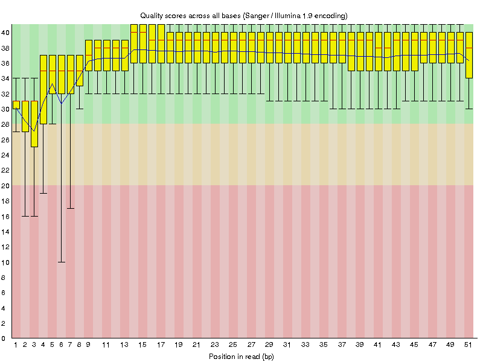

______________________________________________________________________

## 2

Yes. Since the replicates are originated from the same sample, they will have the same biological features, and the differences between them will be only technical issues (defect lanes etc.). However, if it was biological replicates, they shouldn't be merged.

_____________________________________________________________________

## 3

I would combined the files with CAT (concatenating the files one after the other).

_____________________________________________________________________

## 4

\#. The sign '#' in ASCII is 35, which is Phred score of 2 (minus 33), and that means an error every 0.63 bases, i.e. 630 bases per 1000 bases (very bad quality). However, ';' is 59 in ASCII, which is Phred score of 26, and that means that the error rate will be 2.5e-3 bases, i.e. 2.5 bases per 1000 bases. Therefore, as base with Phred score '#' is more likely to be incorrect that a base with Phred score of ';'.

_____________________________________________________________________

## 5

#### Reasons for uncertainty in base calling:

1. __Too close clusters__: the base calling is being done by using image processing of the fluorescence of each cluster, and then averaging on it. However, if two clusters are too close to each other, the optical signal of those two will interfere with each other and will not allow a confident calling of the base in each cluster.

2. __Phase unsynchronization__: if in some of the fragments in a cluster more than one base was added or no base was addad, in the next round they won't be sychronized with the rest of the cluster, and therefore will emit different fluorescence signal. In that case it will ruin the coherency of the cluster signal.

3. __Physical interferences__: any mechanical or physical interference can affect the quality of the base calling, such as dust on the tile, on the camera, air bubbles etc.

_____________________________________________________________________

## 6

Phred score of 41 means an error rate of 7.94e-5. That means that the probability of getting a base wrong even if it got the highest score is 7.94e-3%. In other words, the baseline uncertainty of the Illumina machine is 0.079 base per 1000 bases, or 79 bases per 1M bases. Therefore, in a file with 1M 50bp reads, we have 50M bases in total, so we would expect to have 3972 bases wrong from the basic uncertainty of the machine (i.e. even if all the bases got the highest Phred score possible).

_____________________________________________________________________

## 7

Different kinases has different substrate specificity (motif) for the sequence around the central phospho-acceptor in order to perform phosphorylation. In our lab we have characterized the motifs for the entire Tyrosine kinome (78 kinases). From this profiling, we noticed that evolutionary-closed kinases from the same family have similar motifs. Therefore, the immidiate question is - why there are kinases with very similar motifs?

__Our hypothesis is that the different kinases are expressed in different tissues, and in most of the time are mutually exclusive.__ A very initial analysis of scRNA-seq of mice organs (*Tabula Muris*) showed evidences supporting this hypothesis.

However, there are two major problems with the *Tabula Muris* database:
1. It is single-cell RNA-seq, which is still relatively new field and lack of consensus regarding the analysis methods which should be used for it.
2. Even though there is a high correlation between mice and human tissues, it is better to test our hypothesis in human tissues.

Hence, I believe that NGS data, specifically bulk RNA-seq from different human tissues, can be very valuable in order to test this hypothesis. Practically, I am planning to compare the expression levels of the kinases in the __Tyrosine kinome__ for different Tyrosine kinases' families, and to check whether there is a mutually exclusive expression pattern or not. I will start with the SRC family (SRC, FYN, YES), and will continue with the other families (EPH, DDR, etc.).

_____________________________________________________________________

## 8

For targeting this research question, I will have to use a database for RNA-seq across human tissues (preferentially healthy tissues and not cancerous).

I am planning to use *The Genotype-Tissue Expression (GTEx) database* (https://gtexportal.org/home/), which is a portal for RNA-seq of human tissues of postmortem donors. This database contains 53 different tissues from 714 different donors, and 11688 samples in total. most of the samples (10361) have also genotype information. The raw data (fasta files) are accessible upon request. After obtaining the data and running QC analyses on it, I will specifiy exactly which samples I am going to use for my project.


