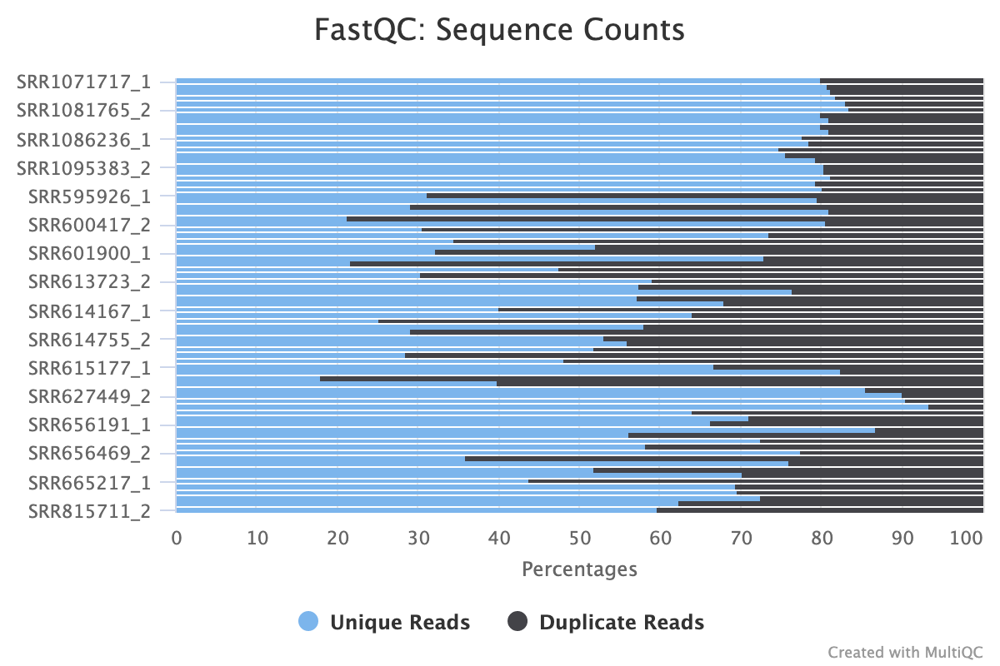
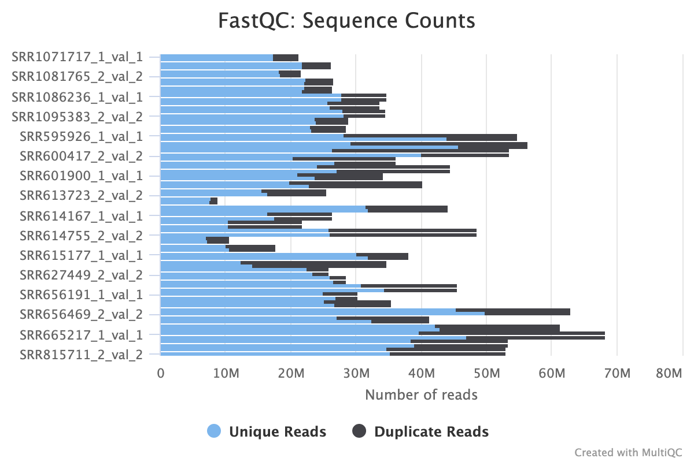

```{r setup, include=FALSE}
knitr::opts_chunk$set(echo = TRUE, warning = FALSE, message = FALSE, error = FALSE)
```

## Introduction

Cancer is a term for uncontrolled proliferation of cells in our body. At the heart of uncontrolled cell proliferation are cellular signaling events. Virtually every aspect of the cell is regulated by post-translational modifications (PTMs). The most extensively-studied PTM is phosphorylation. The phosphorylation state of the proteome differs significantly between normal and cancer cells [@evan2001proliferation, @easty2000protein, @blume2001oncogenic]. Those phosphorylations are being carried out by protein kianses.

Tyrosine kinases are involved in numerous biological processes, with their most widely recognized role as mediators of intercellular communication and, more specifically, permission for cellular growth and proliferation [@hunter2009tyrosine]. The evolutionary origin of tyrosine kinases occurred prior to the entrance into metazoa [@mayer2008clues]. This was a major prerequisite for multicellularity and tissue diversification, as it became more important than ever to control cell numbers and tissue proportions. The tyrosine kinase family diversified in parallel to the tissues and as a result, many, if not all, of the tyrosine kinases are uniquely distributed across mammalian tissues.
 
The tissue-specificity of the tyrosine kinome dictates the cell types that respond to external stimuli and the downstream processes carried out. For example, endothelial cells, those composing our vasculature, uniquely express the receptor tyrosine kinases VEGFR1, KDR, and VEGFR3. As a result, only these cells will respond and proliferate in the presence of their ligand family members, the vascular endothelial growth factors (VEGF) [@ferrara2004vascular]. This is delineated further to the types of vasculature. Blood vessels express mostly KDR and VEGFR1 and lymphatic vessels express mostly VEGFR3, and as a consequence respond to unique subsets of the VEGF family and vascularize different parts of the body.
 
Nonreceptor tyrosine kinases are also uniquely segregated across tissues. Cell of the adaptive immune system, the T-cells and B-cells, require an exclusive set of nonreceptor tyrosine kinases to initiate similar responses to antigens. The cell types use closely related paralogs, yet keep their expression strictly demarcated. Tissues customize kinases this way to promote common signaling processes under their own expression control. Furthermore, it would be wasteful and even detrimental to express redundant kinases in the same cell. For these reasons, tissue and cell types often choose one paralog from a related group tyrosine kinases to carry out similar tasks.

Our laboratory has developed a precision technique that measures the core substrate specificities of individual protein kinases with high reproducibility [@turk2001determination, @hutti2004rapid]. This assay focuses on the 4-6 amino acids neighboring the serine, threonine or tyrosine of interest, a region kinases are exquisitely selective of. The probability matrix describing the favorability for each amino-acid in every position called the *substrate specificy* or the *motif* of the kinase.

Different kinases has different substrate specificity (motif) for the sequence around the central phospho-acceptor in order to perform phosphorylation. In our lab we have characterized the motifs for the entire Tyrosine kinome (80 kinases). From this profiling, we noticed that evolutionary-closed kinases from the same family have similar motifs. Therefore, the immidiate question is - why there are kinases with very similar motifs?

__Our hypothesis is that the different kinases are expressed in different tissues, and in most of the time are mutually exclusive.__ An initial analysis of scRNA-seq of mice organs (*Tabula Muris* [@tabula2018single]) showed evidences supporting this hypothesis.


However, there are two major problems with the *Tabula Muris* database:
1. It is single-cell RNA-seq, which is still relatively new field and lack of consensus regarding the analysis methods which should be used for it.
2. Even though there is a high correlation between mice and human tissues, it is better to test our hypothesis in human tissues.

Hence, I believe that NGS data, specifically bulk RNA-seq from different human tissues, can be very valuable in order to test this hypothesis. Practically, I am planning to compare the expression levels of the kinases in the __Tyrosine kinome__ for different Tyrosine kinases' families, and to check whether there is a mutually exclusive expression pattern or not.

In that project, I am testing our hypothesis for 7 different kinases families (DDR, SrcA, SrcB, Type III RTK, TAM, INSR/IGF1R and Eph) tyrosine kinases, which each one of the kinases within each family has similar substrate spcificity. To that end, I will examine 6 different tissues - bladder, blood, brain, liver, lung, skin and thyroid, whereas for each tissue I will be use 5 samples (except for bladder in which I will use 8 samples). I will process and analyze the RNA-seq data, extract the differential expression of my specific genes in different tissue, and test our hypothesis based on those results.

#### Database

For targeting this research question, I am planning to use *The Genotype-Tissue Expression (GTEx) database* (https://gtexportal.org/home/), which is a portal for RNA-seq of human tissues of postmortem donors. This database contains 53 different tissues from 714 different donors, and 11688 samples in total. most of the samples (10361) have also genotype information. The raw data (fasta files) are accessible upon request.

For the project I chose 7 different tissues (bladder, blood, brain, liver, lung, skin and thyroid), 8 samples from bladder and 5 samples from the rest of the tissues:

```{r, PRINT_SAMPLES}
library(knitr)
library(kableExtra)

samples <- read.table("./databases/project_samples.txt", sep = '\t', header = TRUE)
kable(samples) %>% kable_styling() %>% scroll_box(width = "100%", height = "200px")

```

***

## Results

**The analysis had supported our hypothesis, and showed that when there are few kinses with very similar substrate specificity, they usually will be expressed in different tissues.**

For the SrcA family (FGR, FYN, SRC and YES1), we can see that their substrate specificities are very similar to each other:


According to the *Tabula Muris* database, those kinases are expressed in different tissues. One of the the differences is that FYN and YES1 are expressed in the liver, whereas SRC and FGR are not:


and indeed, when we test the GTEx database, we can see that FYN and YES1 are higher expressed in liver than FGR and SRC, and that in general those kinases are usually expressed mutually exclusively in different tissues:


We can observe the same conclusion for the SrcB family (BLK, HCK, LCK and LYN). Also here, their substrate specificties matrices are very similar:


and according to *Tabula Muris*, HCK and LYN are highly expressed in brain tissues, whereas BLK and LCK are not:


According to the analysis, also in human bulk RNA-seq, HCK and LYN are much higher expressed in the brain than BLK and LCK:


and also in that case, the kinases are usually expressed in different tissues for one another:


#### Future analysis

In order to reinforce the evidences supporting our hypothesis, we should perform a complete analysis of all the tissues available on GTEx, and using all the samples from each tissue. By that, we will get a deeper observation regarding the expression patterns of different kinases.

In addition, it will be interesting to compare the expression analysis to the TCGA database, in order to see if there are any differences between normal tissues and cancer tissues.

***

## Analysis

#### QC of the fastq files and choosing samples for analysis

I started with an initial fastQC analysis on the original files, and then presented it using MultiQC:

```{FASTQC}
spack load fastqc

for f in databases/gtex_files/*/*/original/*
  do fastqc -o ./results/$(echo $f |cut -f 3-4 -d/)/fastqc_original $f --extract
done

multiqc ./Project/results/*/*/fastqc_original/* -o ./Project/results/combined/FastQC\ -\ Original/

```

As we can see, some of the samples have a significant adapter contamination and overrepresented sequences:


In addition, we can see that one sample (SRR600417 - lung), has relatively low quality score.


Moreover, some samples has high percentage of duplicated sequences:




#### Trimming adapters

Since the samples has adapter contamination, I trimmed the reads using TrimGalore:

```{TRIMGALORE}
spack load -r py-cutadapt
spack load -r trimgalore

for f in databases/gtex_files/*/*/original
  do trim_galore --illumina -o databases/gtex_files/$(echo $f |cut -f 3-4 -d/)/trimmed/ --paired $f/*
done

```

I chose the argument `--length` to remain 20bp (default). In addition, I didn't specify the argument `--paired` so every read longer than 20bp after trimming will be preserved, even if its other paired-end is not preserved (since it is shorter than 20bp after trimming). That will allow us to use both paired-end and not paired-end alignment later on.

Then I ran FastQC again for the trimmed fastq files:

```{FASTQC_TRIM}
for f in databases/gtex_files/*/*/trimmed/*.gz
  do fastqc -o ~/angsd/project/results/$(echo $f |cut -f 3-4 -d/)/fastqc_trimmed $f --extract
done

multiqc ./Project/results/*/*/fastqc_trimmed/* -o ./Project/results/combined/FastQC\ -\ Trimmed/

```

As we can see, the overall quality got imporved. First, there are less duplicated sequences (mainly becuase many of them were adapters):




in addition, there are no overrepresented sequences and no adapter content.

#### Alignment

Since we are dealing here with RNA-seq, I used STAR. First, I indexed the reference genome (hg38) and then aligned the fastq files as paired-end:

```{STAR_INDEX}
spack load star@2.6.1

mkdir hg38_STAR_index
STAR --runMode genomeGenerate --runThreadN 8 --genomeDir gh38_STAR_index --genomeFastaFiles ./hg38.fa --sjdbGTFfile hg38_ucsc.gtf --sldbOverhang 75

for f in databases/gtex_files/*/*/trimmed
  do STAR --runMode alignReads --runThreadN 8 --genomeDir /athena/elementolab/scratch/toy2005/GenomeReference_hg38/hg38_STAR_index/ --readFilesIn $f/*.gz --readFilesCommand zcat --outFileNamePrefix /athena/elementolab/scratch/toy2005/angsd/project/databases/gtex_files/$(echo $f | cut -f 3-4 -d/)/star_aligned/$(echo $f | cut -f 4 -d/). --outSAMtype BAM SortedByCoordinate
  samtools stats databases/gtex_files/$(echo $f | cut -f 3-4 -d/)/star_aligned/$(echo $f | cut -f 4 -d/).Aligned.sortedByCoord.out.bam > ~/angsd/project/results/$(echo $f | cut -f 3-4 -d/)/alignment_qc/$(echo $f | cut -f 4 -d/).stats
  samtools flagstat databases/gtex_files/$(echo $f | cut -f 3-4 -d/)/star_aligned/$(echo $f | cut -f 4 -d/).Aligned.sortedByCoord.out.bam > ~/angsd/project/results/$(echo $f | cut -f 3-4 -d/)/alignment_qc/$(echo $f | cut -f 4 -d/).flagstat
done

```

Alignment QC:

```{ALIGN_QC}
spack load samtools@1.8

samtools stats databases/gtex_files/star_aligned/SRR807971/SRR807971_1.Aligned.sortedByCoord.out.bam > ~/angsd/project/results/SRR807971/alignment_qc/SRR807971_1.stats
samtools flagstat databases/gtex_files/star_aligned/SRR807971/SRR807971_1.Aligned.sortedByCoord.out.bam > ~/angsd/project/results/SRR807971/alignment_qc/SRR807971_1.flagstats

multiqc ./Project/results/*/*/alignment_qc/* -o ./Project/results/combined/Alignment\ QC/

```

As we can see, 100% of the reads were mapped:


Even though some of them where multi-mapped:

```{r, PRINT_ALIGN}
samples <- read.table("./results/combined/Alignment QC/samples_alignment.txt", sep = '\t', header = TRUE)
kable(samples) %>% kable_styling() %>% scroll_box(width = "100%", height = "200px")

```

#### Gene count

```{FEATURE_COUNT}
spack load subread

for f in databases/gtex_files/*/*/star_aligned/*.Aligned.sortedByCoord.out.bam
  do featureCounts -T 2 -t gene -f -a databases/GenomeReference_hg38/annotation/Homo_sapiens.GRCh38.77.gtf -o databases/gtex_files/$(echo $f | cut -f 3-4 -d/)/counts/$(echo $f| cut -f 4 -d/)_counts.txt $f
done

```

I examined the number of mapped reads in every sample:

```{r, COUNT_STATS}

library(ggplot2)
library(reshape2)

file_names <- list.files(pattern = "\\.summary$", recursive = TRUE)
m <- matrix(0, ncol = 3, nrow = length(file_names))

gene_counts <- data.frame(m)
colnames(gene_counts) <- c('Assigned','Unassigned_NoFeatures','Unassigned_Ambiguity')
rownames(gene_counts) <- lapply(strsplit(file_names,'/'), function(x) paste(x[2:3], collapse = '/'))

for (f in file_names){
  sample <- paste(strsplit(f,'/')[[1]][2:3], collapse = '/')
  counts <- read.table(f, row.names = 1, header = TRUE)
  for (att in colnames(gene_counts)){
    gene_counts[sample,att] <- counts[att,]
  }
}

gene_counts$Category  <- row.names(gene_counts)
gene_counts_melt <- melt(gene_counts, value.name="Count", variable.name="Variable")
ggplot(data=gene_counts_melt, aes(x=Category, y=Count, fill=Variable)) + geom_bar(stat="identity", position=position_dodge()) + ggtitle("Reads Counts Per Gene - No Multi-Mapped Reads") + xlab("Sample") + ylab("Read Counts") + labs(fill = "Type") + theme(axis.text.x = element_text(angle = 90, hjust = 1))

```

As we can see in the figure above, most of the reads in every sample were assigned uniquely. However, there is a large variance in the amount of reads between samples, which can be a result of different sequencing depth. Therefore, I normalized the counts matrix using `rlog` and compare the differential expression.


```{r, GENE_EXP}

library(DESeq2)

file_names <- list.files(pattern = "._counts.txt$", recursive = TRUE)
sample_matrix <- read.table(file_names[1], row.names = 1, header = TRUE)
m <- matrix(0, ncol = length(file_names), nrow = dim(sample_matrix)[1])

counts_matrix <- data.frame(m)
colnames(counts_matrix) <- lapply(strsplit(file_names,'/'), function(x) paste(x[2:3], collapse = '/'))
rownames(counts_matrix) <- rownames(sample_matrix)

# for (f in file_names){
#   sample <- paste(strsplit(f,'/')[[1]][2:3], collapse = '/')
#   sample_matrix <- read.table(f, row.names = 1, header = TRUE)
#   counts_matrix[,sample] <- sample_matrix[,ncol(sample_matrix)]
# }
# write.table(counts_matrix, file = './results/combined/Combined counts/counts_samples.txt', sep = '\t')
counts_matrix <- read.table('./results/combined/Combined counts/counts_samples.txt', sep = '\t')
colnames(counts_matrix) <- gsub('\\.','/',colnames(counts_matrix))

sample.info <- DataFrame(condition = sapply(strsplit(names(counts_matrix),'/'), function(x) x[1]), row.names = names(counts_matrix))
DESeq.ds <- DESeqDataSetFromMatrix(countData = counts_matrix, colData = sample.info, design = ~ condition)
# DESeq.rlog <- rlog(DESeq.ds, blind = TRUE)
# rlog.norm.counts <- assay(DESeq.rlog)

#write.table(rlog.norm.counts, file = './results/combined/Combined counts/rlog_counts_samples.txt', sep = '\t')
rlog.norm.counts <- read.table('./results/combined/Combined counts/rlog_counts_samples.txt', sep = '\t')
colnames(rlog.norm.counts) <- gsub('\\.','/',colnames(rlog.norm.counts))
rlog.norm.counts <- as.matrix(rlog.norm.counts)

ggplot(aes(x=value, colour=Var2), data=melt(rlog.norm.counts)) + geom_density() + ggtitle("Expression Distribution") + theme(plot.title = element_text(hjust = 0.5)) 

plot(hclust(dist(t(rlog.norm.counts))), labels = colnames(rlog.norm.counts), main = "rlog transformed read counts - Euclidean distance")

corr_coeff <- cor(rlog.norm.counts, method = "pearson")
plot(hclust(as.dist(1 - corr_coeff)), labels = colnames(rlog.norm.counts), main = "rlog transformed read counts - Correlation")

```

We can see that using euclidian distance and correlation, all the samples are clustered together, expcept for the bladder samples which are clustered in 2 groups of 4.

#### Exploratory Analysis

I ran PCA and Tsne plots over the gene expression of the samples, expecting to get similar samples clustered together (due to similar expression pattern).

```{r, GENE_EXP_PCA}

library(Rtsne)
library(scatterplot3d)

rv <- rowVars(rlog.norm.counts)
top_variable <- order(rv, decreasing = TRUE)
pca <- prcomp(t(rlog.norm.counts))
pca.prop.var <- ((pca$sdev^2) / (sum(pca$sdev^2)))*100
df_pca_data <- data.frame(PC1 = pca$x[,1], PC2 = pca$x[,2], sample = sample.info$condition, condition = sample.info$condition)

ggplot(df_pca_data, aes(PC1,PC2, color = sample)) + geom_point(size=2) + labs(title = "PCA plot", x = paste0("PC1 (",pca.prop.var[1],")"), y = paste0("PC2 (",pca.prop.var[2],")"), colour="Tissue") + theme(plot.title = element_text(hjust = 0.5))

set.seed(1)
counts_tsne <- Rtsne(t(unique(rlog.norm.counts)), perplexity = 5, dims = 2, check_duplicates = FALSE)
ggplot(as.data.frame(counts_tsne$Y), aes(x = counts_tsne$Y[,1], y = counts_tsne$Y[,2], colour = sample.info$condition)) + geom_point(alpha = 1) + labs(title = "Tsne Plot", x = "Tsne 1", y = "Tsne 2", colour="Tissue") + theme(plot.title = element_text(hjust = 0.5))

```

As we can see, the different samples are clustered together in the PCA plot, and are even more clustered in the Tsne plot. Interestignly, also here the 8 bladder samples are clustered in 2 groups of 4.

#### Expression Analysis - SrcA Family

Finally, in order to test our hypothesis for a specific family, I compared the expression levels of each kinase within that family across tissues, and performed a two-tailed independent T-test for find statistically significant changes in the expression levels. Here, I am presenting the results for two specific families (SrcA and SrcB) in two tissues (liver and brain respectively), whereas the results for all the families across all tissues are provided in the Supplementary Information section.

For the SrcA family, according to the _Tabula Muris_ data, we can see that FYN and YES1 are expressed in liver tissue, whereas SRC and FGR are not:


In an agreement with this data, we can see that in liver tissues from the GTEx database, FYN and YES1 are expressed in higher levels than FGR and SRC:

```{r, GENE_EXP_STAT_SRCA, fig.show='asis'}

library(biomaRt)
library(reshape2)
library(ggsignif)
library(gridExtra)
library(gplots)

ensembl <- useDataset("hsapiens_gene_ensembl", useMart("ensembl"))

kinases_family <- "SrcA Family"
kinases <- sort(c("SRC","FYN","YES1","FGR"))

kin_ensembl <- getBM(attributes = "ensembl_gene_id", filters="hgnc_symbol", values=kinases, mart=ensembl)
kin_ensembl <- kin_ensembl$ensembl_gene_id[unlist(lapply(kin_ensembl, function(x) x %in% rownames(rlog.norm.counts)))]

kin_exp <- rlog.norm.counts[kin_ensembl,]
kin_exp <- kin_exp[rowSums(kin_exp) > 0,]
rownames(kin_exp) <- kinases
colnames(kin_exp) <- sapply(strsplit(colnames(kin_exp),'/'), function(x) x[1])

tissues <- sort(unique(sapply(strsplit(colnames(DESeq.ds),'/'), function(x) x[1])))
sample_exp <- melt(kin_exp)[,c(2,1,3)]
colnames(sample_exp) <- c("tissue","kinase","exp_value")

t <- "liver"
tissue_exp <- sample_exp[sample_exp$tissue == t,]
plt <- ggplot(tissue_exp, aes(x=kinase, y=exp_value, fill=kinase)) + geom_boxplot() + geom_dotplot(binaxis='y', stackdir='center', binwidth = 0.3, dotsize=0.7) + ggtitle(t) + theme(plot.title = element_text(hjust = 0.5)) + geom_signif(comparisons = split(combn(kinases,2), rep(1:ncol(combn(kinases,2)), each = nrow(combn(kinases,2)))), map_signif_level=TRUE, step_increase = 0.1, vjust = 0.5, textsize = , margin_top = 0.1) + xlab("Kinase") + ylab("Expression Level (rlog)")
plot(plt)

```

For the SrcA family, we will plot a heatmap of the expression of the kianses across different tissues:

```{r, GENE_HEATMAP_SRCA}
heatmap.2(t(kin_exp), Colv = FALSE, Rowv = FALSE, dendrogram = 'none', col = bluered(25), trace = 'column', density.info = 'density', cexCol = 1, srtCol = 45, cexRow = 1, rowsep=c(8,13,18,23,28,33), sepcolor="black", sepwidth=c(5,0.2), labRow = c(NA,NA,NA,"Bladder",NA,NA,NA,NA,NA,NA,"Blood",NA,NA,NA,NA,"Brain",NA,NA,NA,NA,"Liver",NA,NA,NA,NA,"Lung",NA,NA,NA,NA,"Skin",NA,NA,NA,NA,"Thyroid",NA,NA), tracecol = "black", key.title = NA, main = kinases_family, xlab = "Kinase", ylab = "Tissue")

```

As we can see, the kinases expression are mostly mutually exclusive, i.e. when a one or two kinaes are highly expressed in a tissue, the other kinases are lower expressed.

#### Expression Analysis - SrcB Family

For the SrcB family, according to the _Tabula Muris_ data, we can see that HCK and LYN are expressed in brain cells, whereas BLK and LCK are not:


And also in that case, in consistency with this data, we can see that in brain samples from the GTEx database, HCK and LYN are expressed in higher levels than BLK and LCK:

```{r, GENE_EXP_STAT_SRCB, fig.show='asis'}
kinases_family <- "SrcB Family"
kinases <- sort(c("LCK","HCK","BLK","LYN"))

kin_ensembl <- getBM(attributes = "ensembl_gene_id", filters="hgnc_symbol", values=kinases, mart=ensembl)
kin_ensembl <- kin_ensembl$ensembl_gene_id[unlist(lapply(kin_ensembl, function(x) x %in% rownames(rlog.norm.counts)))]

kin_exp <- rlog.norm.counts[kin_ensembl,]
kin_exp <- kin_exp[rowSums(kin_exp) > 0,]
rownames(kin_exp) <- kinases
colnames(kin_exp) <- sapply(strsplit(colnames(kin_exp),'/'), function(x) x[1])

tissues <- sort(unique(sapply(strsplit(colnames(DESeq.ds),'/'), function(x) x[1])))
sample_exp <- melt(kin_exp)[,c(2,1,3)]
colnames(sample_exp) <- c("tissue","kinase","exp_value")

t <- "brain"
tissue_exp <- sample_exp[sample_exp$tissue == t,]
plt <- ggplot(tissue_exp, aes(x=kinase, y=exp_value, fill=kinase)) + geom_boxplot() + geom_dotplot(binaxis='y', stackdir='center', binwidth = 0.3, dotsize=0.7) + ggtitle(t) + theme(plot.title = element_text(hjust = 0.5)) + geom_signif(comparisons = split(combn(kinases,2), rep(1:ncol(combn(kinases,2)), each = nrow(combn(kinases,2)))), map_signif_level=TRUE, step_increase = 0.1, vjust = 0.5, textsize = , margin_top = 0.1) + xlab("Kinase") + ylab("Expression Level (rlog)")
plot(plt)

```

For the SrcA family, we will plot a heatmap of the expression of the kianses across different tissues:

```{r, GENE_HEATMAP_SRCB}
heatmap.2(t(kin_exp), symkey = FALSE, Colv = FALSE, Rowv = FALSE, dendrogram = 'none', col = bluered(25), trace = 'column', density.info = 'density', cexCol = 1, srtCol = 45, cexRow = 1, rowsep=c(8,13,18,23,28,33), sepcolor="black", sepwidth=c(5,0.2), labRow = c(NA,NA,NA,"Bladder",NA,NA,NA,NA,NA,NA,"Blood",NA,NA,NA,NA,"Brain",NA,NA,NA,NA,"Liver",NA,NA,NA,NA,"Lung",NA,NA,NA,NA,"Skin",NA,NA,NA,NA,"Thyroid",NA,NA), tracecol = "black", key.title = NA, main = kinases_family, xlab = "Kinase", ylab = "Tissue")

```

Also here, the kinases expression are mostly mutually exclusive.

***

## Discussion

First and foremost, in order for the analysis to be complete, we need to test those expression patterns across all the available tissues, using all the available samples. In addition, during the analysis I have encountered some issues I had to address:

1. Sample size: in order to test this hypothesis, I had to compare the expression levels of different kinases in a tissue, and therefore i had to use many samples for performing a statistical comparison. I used 5 samples per tissue, but in the future all the samples will have to be used.

2. Kinase expression level: in our cells, there are sometimes many different isoforms for the same kinase. In order to obtain the expression level of the kianse on average, I used the feature *"gene"* for counting the features. Then, I considered several different normalization methods (TPM, SF and rlog), and evetually I picked the rlog normalization since the library size (sequencing depth etc.) is highly varied between samples and tissues.

3. Statistical test: usually, people are using RNA-seq data to compare the same genes between different samples. In that case, I tried to compare different genes across one sample type at a time. Therefore, once i got the expression pattern, i had to use a statistical test for finding the differential expression. After trying some widely used tests (T-test, wilcoxon test, ANOVA), I saw that there are not much difference between them, and I decided to use the classical T-test for the statistical significance.

For the full results of all the kinases families tested, please refer to the Supplementary Information section.

***

## Supplementary Information

```{r, SUPP_INFO, fig.show='asis'}

all_families <- list("DDR Family","SrcA Family","SrcB Family","Type III RTK Family","TAM Family","INSR/IGF1R Receptor Family","Eph Family")
family_kinases <- list(sort(c("DDR1","DDR2")), sort(c("SRC","FYN","YES1","FGR")), sort(c("LCK","HCK","BLK","LYN")), sort(c("CSF1R","KIT")), sort(c("TYRO3","AXL","MERTK")), sort(c("INSR","IGF1R")), sort(c(paste0("EphA",1:8), paste0("EphB",c(1,2,4)))))

# kinases_family <- "DDR Family"
# kinases <- sort(c("DDR1","DDR2"))
# kinases_family <- "SrcA Family"
# kinases <- sort(c("SRC","FYN","YES1","FGR"))
# kinases_family <- "SrcB Family"
# kinases <- sort(c("LCK","HCK","BLK","LYN"))
# kinases_family <- "Type III RTK Family"
# kinases <- sort(c("CSF1R","KIT"))
# kinases_family <- "TAM Family"
# kinases <- sort(c("TYRO3","AXL","MERTK"))
# kinases_family <- "INSR/IGF1R Receptor Family"
# kinases <- sort(c("INSR","IGF1R"))
# kinases_family <- "Eph Family"
# kinases <- sort(c(paste0("EphA",1:8), paste0("EphB",c(1,2,4))))

for (kin_fam in mapply(list, all_families, family_kinases, SIMPLIFY=F)){
  
  kinases_family <- kin_fam[[1]]
  kinases <- kin_fam[[2]]
  
  print(kinases_family)
  
  kin_ensembl <- getBM(attributes = "ensembl_gene_id", filters="hgnc_symbol", values=kinases, mart=ensembl)
  kin_ensembl <- kin_ensembl$ensembl_gene_id[unlist(lapply(kin_ensembl, function(x) x %in% rownames(rlog.norm.counts)))]
  
  kin_exp <- rlog.norm.counts[kin_ensembl,]
  kin_exp <- kin_exp[rowSums(kin_exp) > 0,]
  rownames(kin_exp) <- kinases
  colnames(kin_exp) <- sapply(strsplit(colnames(kin_exp),'/'), function(x) x[1])
  
  tissues <- sort(unique(sapply(strsplit(colnames(DESeq.ds),'/'), function(x) x[1])))
  sample_exp <- melt(kin_exp)[,c(2,1,3)]
  colnames(sample_exp) <- c("tissue","kinase","exp_value")
  
  plots <- list()
  
  for (i in 1:length(tissues)){
    t <- tissues[i]
    tissue_exp <- sample_exp[sample_exp$tissue == t,]
    # plots[[i]] <- ggplot(tissue_exp, aes(x=kinase, y=exp_value, fill=kinase)) + geom_boxplot() + geom_dotplot(binaxis='y', stackdir='center', binwidth = 0.3) + ggtitle(t) + theme(plot.title = element_text(hjust = 0.5)) + geom_signif(comparisons = split(combn(kinases,2), rep(1:ncol(combn(kinases,2)), each = nrow(combn(kinases,2)))), map_signif_level=TRUE, step_increase = 0.1, vjust = 0.5, textsize = , margin_top = 0.1) + xlab("Kinase") + ylab("Expression Level (rlog)")
    plots[[i]] <- ggplot(tissue_exp, aes(x=kinase, y=exp_value, fill=kinase)) + geom_boxplot() + geom_dotplot(binaxis='y', stackdir='center', binwidth = 0.3, dotsize = 0.5) + ggtitle(t) + theme(plot.title = element_text(hjust = 0.5)) +  xlab("Kinase") + ylab("Expression Level (rlog)")
    # plot(plots[[i]])
  }
  
  # pdf(paste0('./figures/', paste0(kinases, sep = "_", collapse = ""), 'exp_levels.pdf'), width = 10, height = 5, paper = 'special')
  do.call(grid.arrange,plots)
  # dev.off()
  
  plt <- ggplot(sample_exp, aes(x=tissue, y=exp_value, fill=kinase)) + geom_boxplot() + ggtitle(kinases_family) + theme(plot.title = element_text(hjust = 0.5)) + xlab("Tissue") + ylab("Expression Level (rlog)") + geom_vline(xintercept = (1:6 + 0.5), linetype = "dashed")
  plot(plt)
  
  heatmap.2(t(kin_exp), Colv = FALSE, Rowv = FALSE, dendrogram = 'none', col = bluered(25), trace = 'column', density.info = 'density', symkey = FALSE, cexCol = 1, srtCol = 45, cexRow = 1, rowsep=c(8,13,18,23,28,33), sepcolor="black", sepwidth=c(5,0.2), labRow = c(NA,NA,NA,"Bladder",NA,NA,NA,NA,NA,NA,"Blood",NA,NA,NA,NA,"Brain",NA,NA,NA,NA,"Liver",NA,NA,NA,NA,"Lung",NA,NA,NA,NA,"Skin",NA,NA,NA,NA,"Thyroid",NA,NA), tracecol = "black", key.title = NA, main = kinases_family, xlab = "Kinase", ylab = "Tissue", symbreaks = FALSE)
}

```

***

# References