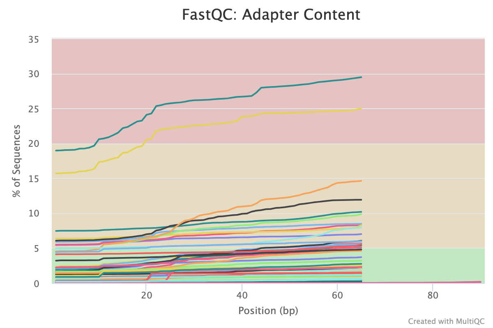
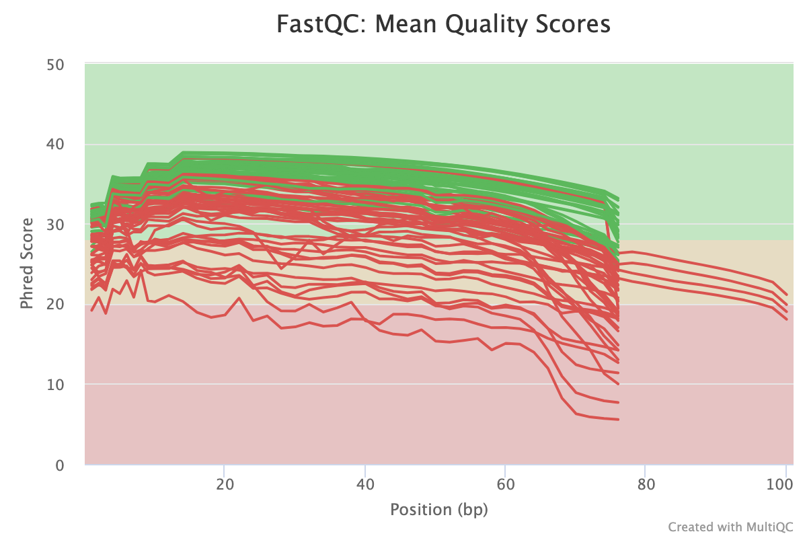
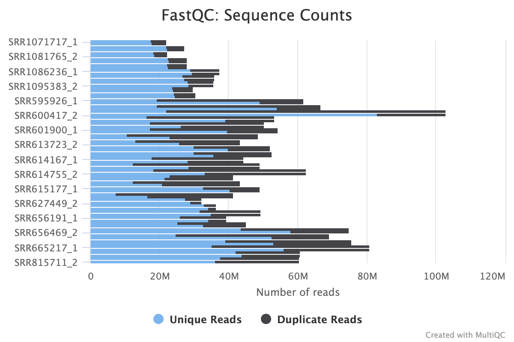
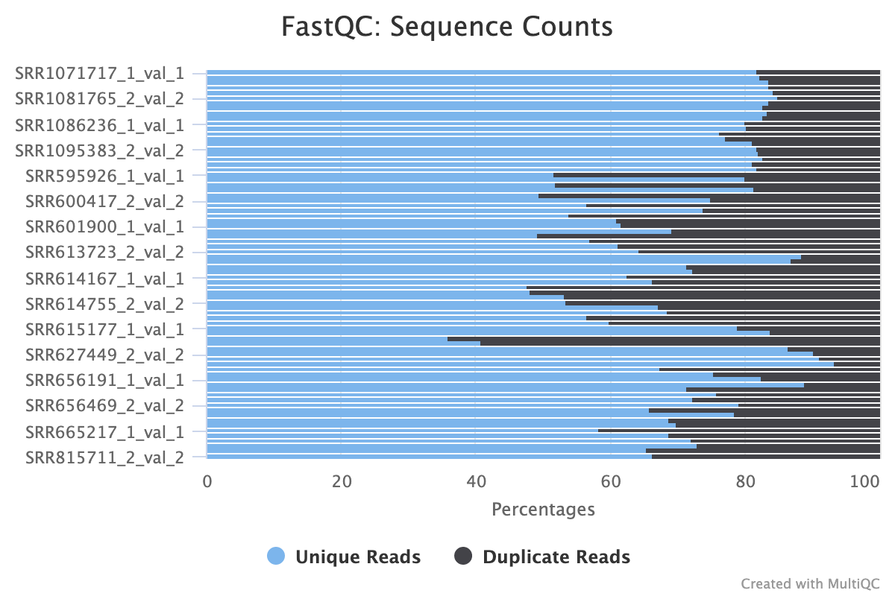
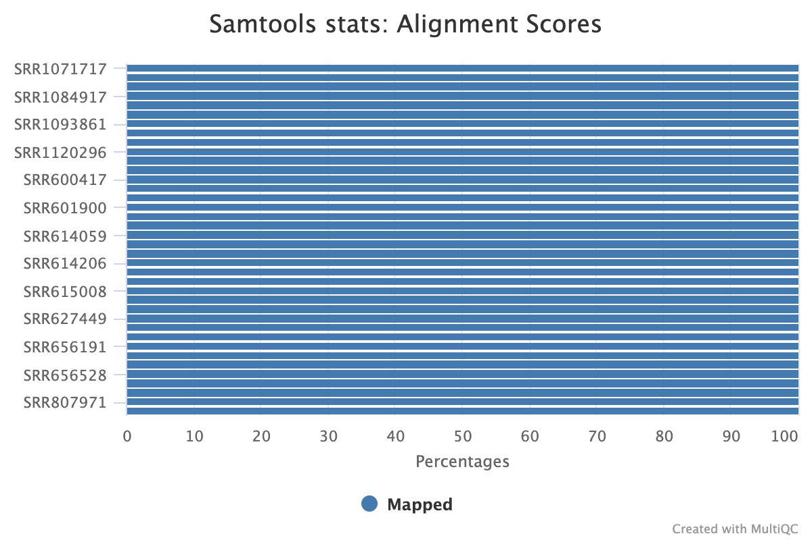

```{r setup, include=FALSE}
knitr::opts_chunk$set(echo = TRUE)
```

## Introduction

Different kinases has different substrate specificity (motif) for the sequence around the central phospho-acceptor in order to perform phosphorylation. In our lab we have characterized the motifs for the entire Tyrosine kinome (78 kinases). From this profiling, we noticed that evolutionary-closed kinases from the same family have similar motifs. Therefore, the immidiate question is - why there are kinases with very similar motifs?

__Our hypothesis is that the different kinases are expressed in different tissues, and in most of the time are mutually exclusive.__ A very initial analysis of scRNA-seq of mice organs (*Tabula Muris*) showed evidences supporting this hypothesis.

However, there are two major problems with the *Tabula Muris* database:
1. It is single-cell RNA-seq, which is still relatively new field and lack of consensus regarding the analysis methods which should be used for it.
2. Even though there is a high correlation between mice and human tissues, it is better to test our hypothesis in human tissues.

Hence, I believe that NGS data, specifically bulk RNA-seq from different human tissues, can be very valuable in order to test this hypothesis. Practically, I am planning to compare the expression levels of the kinases in the __Tyrosine kinome__ for different Tyrosine kinases' families, and to check whether there is a mutually exclusive expression pattern or not.

In that project, I am testing our hypothesis for the TAM receptor tyrosine kinases - Tyro3, Axl, and Mer - which have similar substrate spcificity. To that end, I will examine 4 different tissues - bladder, brain, lung and liver, whereas for each tissue I will be choose 1 sample out of two optional (based on QC analysis). I will process and analyze the RNA-seq data, extract the differential expression of my specific genes in different tissue, and test our hypothesis based on those results.


## Database

For targeting this research question, I am planning to use *The Genotype-Tissue Expression (GTEx) database* (https://gtexportal.org/home/), which is a portal for RNA-seq of human tissues of postmortem donors. This database contains 53 different tissues from 714 different donors, and 11688 samples in total. most of the samples (10361) have also genotype information. The raw data (fasta files) are accessible upon request.

For the project I chose 4 different tissues (bladder, brain, lung and liver), 2 samples from each:

| Run        | SRA_Sample | Sample_Name                  | histological_type | is_tumor | sex    | SRA_Study |
|------------|------------|------------------------------|-------------------|----------|--------|-----------|
| SRR1085402 | SRS524923  | GTEX-SNMC-0826-SM-4DM66      | Bladder           | No       | male   | SRP012682 |
| SRR1086236 | SRS524959  | GTEX-TMMY-1526-SM-4DXST      | Bladder           | No       | female | SRP012682 |
| SRR595926  | SRS332984  | GTEX-N7MS-0011-R10A-SM-2HMJK | Brain             | No       | male   | SRP012682 |
| SRR598253  | SRS332955  | GTEX-Q2AG-0011-R6A-SM-2HML7  | Brain             | No       | female | SRP012682 |
| SRR600417  | SRS333244  | GTEX-Q2AI-0526-SM-2I3EJ      | Lung              | No       | male   | SRP012682 |
| SRR600584  | SRS333222  | GTEX-OHPL-0526-SM-2HMIX      | Lung              | No       | female | SRP012682 |
| SRR807971  | SRS408127  | GTEX-OOBJ-0826-SM-3NB2K      | Liver             | No       | male   | SRP012682 |
| SRR659649  | SRS389590  | GTEX-U3ZN-0226-SM-3DB8D      | Liver             | No       | female | SRP012682 |

## QC of the fastq files and choosing samples for analysis

I started with an initial fastQC analysis on the original files, and then presented it using MultiQC:

```{FASTQC}
spack load fastqc

for f in databases/gtex_files/*/*/original/*
  do fastqc -o ./results/$(echo $f |cut -f 3-4 -d/)/fastqc_original $f --extract
done

multiqc ./Project/results/*/*/fastqc_original/* -o ./Project/results/combined/FastQC\ -\ Original/

```

As we can see, some of the samples have a significant adapter contamination and overrepresented sequences:




In addition, we can see that one sample (SRR600417 - lung), has relatively low quality score.



Moreover, some samples has high percentage of duplicated sequences:




Based on the QC analysis above, considering the amount of duplicated sequences and the quality scores, I decided to pick the following samples from each tissue:

| Run        | SRA_Sample | Sample_Name                  | histological_type | is_tumor | sex    | SRA_Study |
|------------|------------|------------------------------|-------------------|----------|--------|-----------|
| SRR1085402 | SRS524923  | GTEX-SNMC-0826-SM-4DM66      | Bladder           | No       | male   | SRP012682 |
| SRR595926  | SRS332984  | GTEX-N7MS-0011-R10A-SM-2HMJK | Brain             | No       | male   | SRP012682 |
| SRR600584  | SRS333222  | GTEX-OHPL-0526-SM-2HMIX      | Lung              | No       | female | SRP012682 |
| SRR807971  | SRS408127  | GTEX-OOBJ-0826-SM-3NB2K      | Liver             | No       | male   | SRP012682 |

## Trimming adapters

Since the samples has adapter contamination, I trimmed the reads using TrimGalore:

```{TRIMGALORE}
spack load -r py-cutadapt
spack load -r trimgalore

for f in databases/gtex_files/*/*/original
  do trim_galore --illumina -o databases/gtex_files/$(echo $f |cut -f 3-4 -d/)/trimmed/ --paired $f/*
done

```

I chose the argument `--length` to remain 20bp (default). In addition, I didn't specify the argument `--paired` so every read longer than 20bp after trimming will be preserved, even if its other paired-end is not preserved (since it is shorter than 20bp after trimming). That will allow us to use both paired-end and not paired-end alignment later on.

Then I ran FastQC again for the trimmed fastq files:

```{FASTQC_TRIM}
for f in databases/gtex_files/*/*/trimmed/*.gz
  do fastqc -o ~/angsd/project/results/$(echo $f |cut -f 3-4 -d/)/fastqc_trimmed $f --extract
done

multiqc ./Project/results/*/*/fastqc_trimmed/* -o ./Project/results/combined/FastQC\ -\ Trimmed/

```

As we can see, the overall quality got imporved. First, there are less duplicated sequences (mainly becuase many of them were adapters):




in addition, there are no overrepresented sequences and no adapter content.

## Alignment

Since we are dealing here with RNA-seq, I used STAR. First, I indexed the reference genome (hg38) and then aligned the fastq files as paired-end:

```{STAR_INDEX}
spack load star@2.6.1

mkdir hg38_STAR_index
STAR --runMode genomeGenerate --runThreadN 8 --genomeDir gh38_STAR_index --genomeFastaFiles ./hg38.fa --sjdbGTFfile hg38_ucsc.gtf --sldbOverhang 75

for f in databases/gtex_files/*/*/trimmed
  do STAR --runMode alignReads --runThreadN 8 --genomeDir /athena/elementolab/scratch/toy2005/GenomeReference_hg38/hg38_STAR_index/ --readFilesIn $f/*.gz --readFilesCommand zcat --outFileNamePrefix /athena/elementolab/scratch/toy2005/angsd/project/databases/gtex_files/$(echo $f | cut -f 3-4 -d/)/star_aligned/$(echo $f | cut -f 4 -d/). --outSAMtype BAM SortedByCoordinate
  samtools stats databases/gtex_files/$(echo $f | cut -f 3-4 -d/)/star_aligned/$(echo $f | cut -f 4 -d/).Aligned.sortedByCoord.out.bam > ~/angsd/project/results/$(echo $f | cut -f 3-4 -d/)/alignment_qc/$(echo $f | cut -f 4 -d/).stats
  samtools flagstat databases/gtex_files/$(echo $f | cut -f 3-4 -d/)/star_aligned/$(echo $f | cut -f 4 -d/).Aligned.sortedByCoord.out.bam > ~/angsd/project/results/$(echo $f | cut -f 3-4 -d/)/alignment_qc/$(echo $f | cut -f 4 -d/).flagstat
done

```

Alignment QC:

```{ALIGN_QC}
spack load samtools@1.8

samtools stats databases/gtex_files/star_aligned/SRR807971/SRR807971_1.Aligned.sortedByCoord.out.bam > ~/angsd/project/results/SRR807971/alignment_qc/SRR807971_1.stats
samtools flagstat databases/gtex_files/star_aligned/SRR807971/SRR807971_1.Aligned.sortedByCoord.out.bam > ~/angsd/project/results/SRR807971/alignment_qc/SRR807971_1.flagstats

multiqc ./Project/results/*/*/alignment_qc/* -o ./Project/results/combined/Alignment\ QC/

```

As we can see, 100% of the reads were mapped:



Even though some of them where multi-mapped:

| Sample Name | M Reads Mapped | % Mapped | M Non-Primary | % MapQ 0 Reads | Error rate | % Proper Pairs |
|-------------|----------------|----------|---------------|----------------|------------|----------------|
| SRR1085402  | 55.8           | 100.0%   | 3.7           | 0.3%           | 0.00%      | 99.9%          |
| SRR595926   | 114.7          | 100.0%   | 8.0           | 0.2%           | 0.00%      | 99.7%          |
| SRR600584   | 70.7           | 100.0%   | 3.8           | 0.2%           | 0.00%      | 99.7%          |
| SRR807971   | 114.2          | 100.0%   | 9.3           | 0.3%           | 0.00%      | 99.8%          |

## Gene count

```{FEATURE_COUNT}
spack load subread

for f in databases/gtex_files/*/*/star_aligned/*.Aligned.sortedByCoord.out.bam
  do featureCounts -T 2 -t gene -f -a databases/GenomeReference_hg38/annotation/Homo_sapiens.GRCh38.77.gtf -o databases/gtex_files/$(echo $f | cut -f 3-4 -d/)/counts/$(echo $f| cut -f 4 -d/)_counts.txt $f
done

```

Now we will normalize the counts matries and compare the differential expression.

```{r, COUNT_STATS}

library(ggplot2)
library(reshape2)

file_names <- list.files(pattern = "\\.summary$", recursive = TRUE)
m <- matrix(0, ncol = 3, nrow = length(file_names))

gene_counts <- data.frame(m)
colnames(gene_counts) <- c('Assigned','Unassigned_NoFeatures','Unassigned_Ambiguity')
rownames(gene_counts) <- lapply(strsplit(file_names,'/'), function(x) paste(x[2:3], collapse = '/'))

for (f in file_names){
  sample <- paste(strsplit(f,'/')[[1]][2:3], collapse = '/')
  counts <- read.table(f, row.names = 1, header = TRUE)
  for (att in colnames(gene_counts)){
    gene_counts[sample,att] <- counts[att,]
  }
}

gene_counts$Category  <- row.names(gene_counts)
gene_counts_melt <- melt(gene_counts, value.name="Count", variable.name="Variable")
ggplot(data=gene_counts_melt, aes(x=Category, y=Count, fill=Variable)) + geom_bar(stat="identity", position=position_dodge()) + ggtitle("Reads Counts Per Gene - No Multi-Mapped Reads") + xlab("Sample") + ylab("Read Counts") + labs(fill = "Type")

```

```{r, GENE_EXP}

library(DESeq2)

file_names <- list.files(pattern = "._counts.txt$", recursive = TRUE)
sample_matrix <- read.table(file_names[1], row.names = 1, header = TRUE)
m <- matrix(0, ncol = length(file_names), nrow = dim(sample_matrix)[1])

counts_matrix <- data.frame(m)
colnames(counts_matrix) <- lapply(strsplit(file_names,'/'), function(x) paste(x[2:3], collapse = '/'))
rownames(counts_matrix) <- rownames(sample_matrix)

for (f in file_names){
  sample <- paste(strsplit(f,'/')[[1]][2:3], collapse = '/')
  sample_matrix <- read.table(f, row.names = 1, header = TRUE)
  counts_matrix[,sample] <- sample_matrix[,ncol(sample_matrix)]
}

sample.info <- DataFrame(condition = names(counts_matrix), row.names = names(counts_matrix) )
DESeq.ds <- DESeqDataSetFromMatrix(countData = counts_matrix, colData = sample.info, design = ~ condition)
DESeq.rlog <- rlog(DESeq.ds, blind = TRUE)
rlog.norm.counts <- assay(DESeq.rlog)

```
